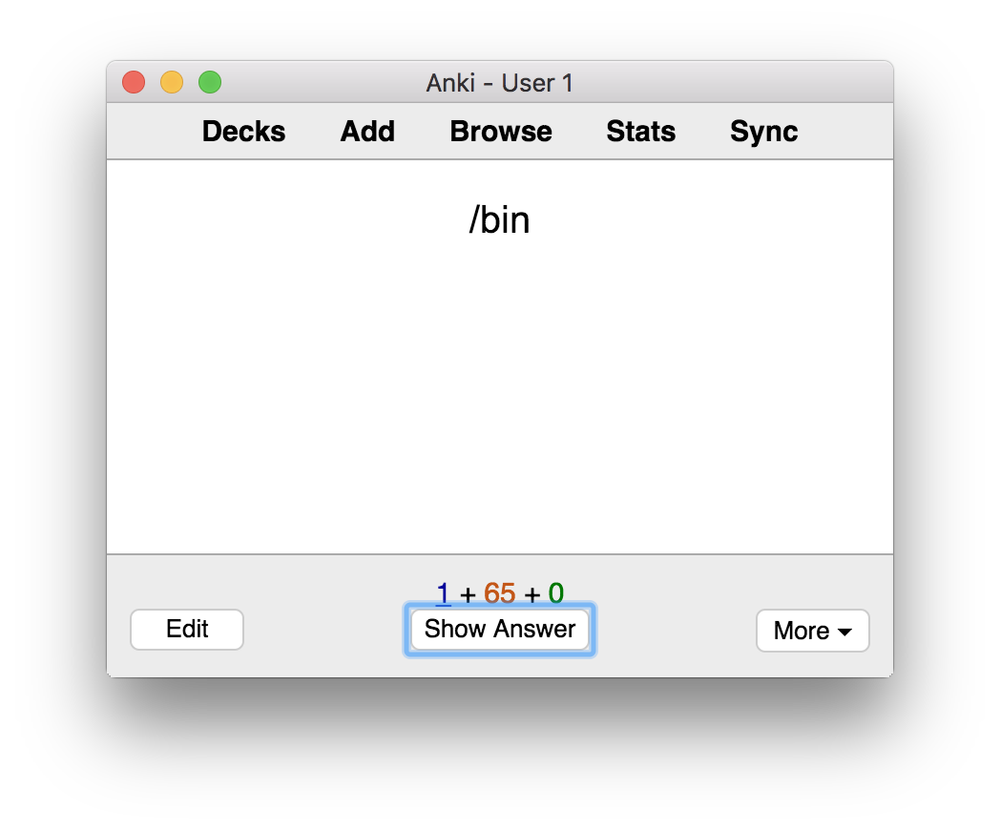
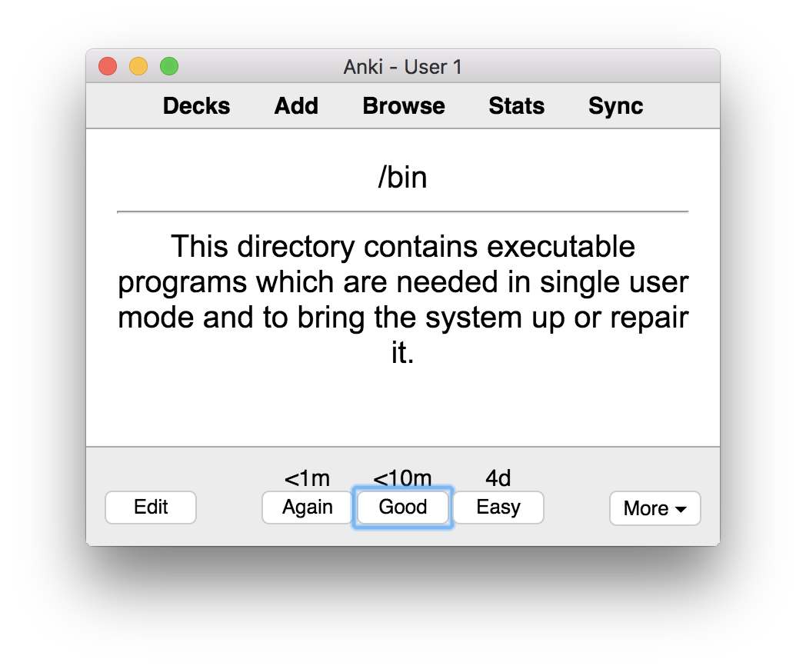
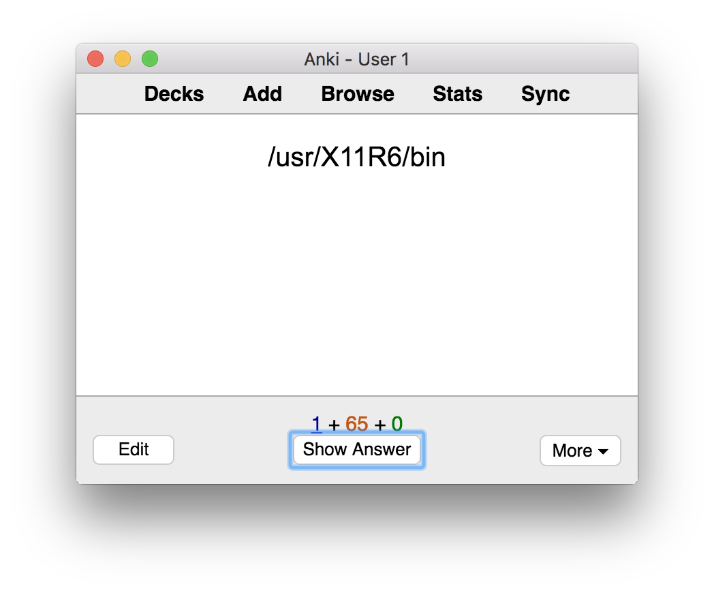
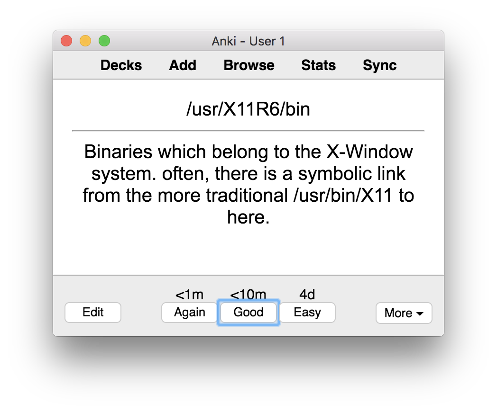

## Linux Filesystem Hierarchy Anki Deck

This is the whole content of Linux's `man hier` in a Anki Deck

To import this deck in Anki, go to "Import File" and select "Text separated by tabs or semicolons"

You can download Anki here: https://apps.ankiweb.net/ 

### Example
*Question:*

*Answer:* 

*Question:*

*Answer:* 

